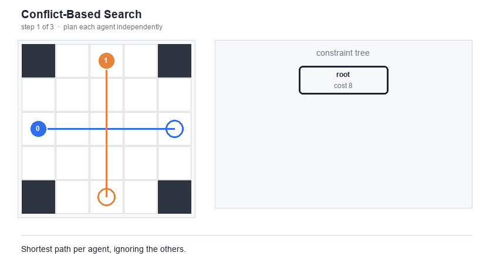
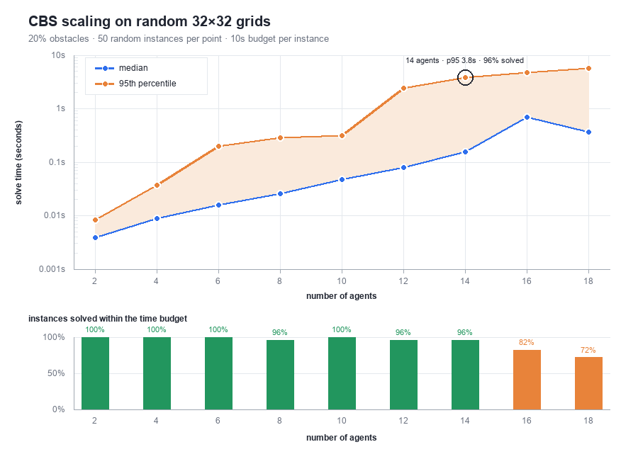

# CBS: Conflict-Based Search for Multi-Agent Pathfinding

A Python implementation of **Conflict-Based Search (CBS)**, an optimal algorithm for the Multi-Agent Path Finding (MAPF) problem: given a grid, a set of agents, and a start/goal cell for each, find a set of paths per agent that are shortest and free of collisions.

Implementation of: [Sharon, Stern, Felner & Sturtevant, *"Conflict-Based Search For Optimal Multi-Agent Pathfinding"*](https://www.sciencedirect.com/science/article/pii/S0004370214001386).

<p align="center">
  <br>
  <em>Both agents want (2,2) at t=2. CBS branches on that conflict and replans one of them.</em>
</p>

## How it works

CBS is a two-level algorithm:

- **High level** ([`high_level.py`](mapf/high_level.py)) searches a constraint tree (CT). Each node holds one path per agent and the set of constraints that produced them. Starting from an unconstrained root, it repeatedly pops the lowest-cost node, checks the joint solution for the first conflict between any two agents, and branches into two children, each forbidding one of the two agents from the conflicting move. The search ends when a node's joint solution is completely conflict-free; because nodes are expanded in cost order, that solution must be optimal.

- **Low level** ([`low_level.py`](mapf/low_level.py)) plans a single agent's path with `space_time_astar`, an A* search over (cell, timestep) states.

Two conflict types are detected and resolved:
- **Vertex conflicts** — two agents occupy the same cell at the same time
- **Edge conflicts** — two agents swap cells across the same timestep

## Project structure

| File | Responsibility |
|---|---|
| [`mapf/grid.py`](mapf/grid.py) | Static grid consisting of bounds, obstacles, 4-connected neighbors |
| [`mapf/heuristic.py`](mapf/heuristic.py) | Backward BFS from each goal, used as heuristic for A* |
| [`mapf/constraints.py`](mapf/constraints.py) | `VertexConstraint` / `EdgeConstraint` — what the high level hands to the low level |
| [`mapf/low_level.py`](mapf/low_level.py) | `space_time_astar` — A* for finding shortest path of a single agent|
| [`mapf/high_level.py`](mapf/high_level.py) | `conflict_based_search` — the constraint-tree search over joint solutions |
| [`bench.py`](bench.py) | Scaling sweep over agent count, with an independent solution verifier |
| [`plot.py`](plot.py) | Draws the scaling chart from `bench.py`'s JSON |
| [`viz.py`](viz.py) | Renders the conflict-resolution gif by replaying the real search |

## Usage

```python
from mapf.grid import Grid
from mapf.high_level import conflict_based_search

grid = Grid(width=5, height=5, obstacles=frozenset())

agents = {
    0: ((0, 0), (4, 4)),  # agent 0: start -> goal
    1: ((4, 0), (0, 4)),  # agent 1: start -> goal
}

solution = conflict_based_search(grid, agents)
# solution: dict[agent_id] -> list of (x, y) cells
```

## Performance

<p align="center">
  
</p>

Ran trails on random 32×32 grids with 20% obstacles and 50 random instances per agent count, 10 second budget
each. Start and goals are chosen to ensure a solution, and every solved instance is re-checked by an independent verifier for correct endpoints, legal moves, and vertex/edge conflicts.

| agents | solved | median | p95 | max |
|---|---|---|---|---|
| 2 | 50/50 | 0.004s | 0.008s | 0.010s |
| 4 | 50/50 | 0.009s | 0.037s | 0.042s |
| 6 | 50/50 | 0.016s | 0.198s | 0.251s |
| 8 | 48/50 | 0.025s | 0.283s | 1.907s |
| 10 | 50/50 | 0.047s | 0.313s | 0.579s |
| 12 | 48/50 | 0.079s | 2.415s | 3.380s |
| 14 | 48/50 | 0.156s | 3.831s | 5.383s |
| 16 | 41/50 | 0.687s | 4.750s | 5.824s |
| 18 | 36/50 | 0.360s | 5.656s | 8.660s |


```bash
python3 bench.py --trials 50 --json docs/bench.json   # run the sweep
python3 plot.py                                       # draw the chart
python3 viz.py                                        # draw the conflict gif
```

## Issues:
**No solution** - code hangs if, say, you put two robots in a 1 wide room, going head on. The original paper uses a check for this. 

**Unoptimal Hueristic calling** - BFS is rerun everytime in low_level when it doesn't need to and instead can be precomputed and stored for each goal. 


## AI Use:
Function outlines and signatures, some classes, and readme were outlined with Claude Code and test files and were genearted with AI. All core algorithms like high_level.py, low_level.py and heuristic.py are my own. 
